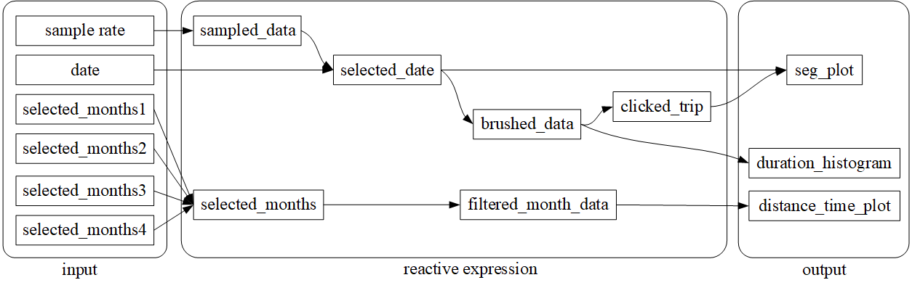

# Stats 436 - HW2

## Dataset Description

The dataset used in this assignment can be downloaded from the [NYC government website](https://www.nyc.gov/site/tlc/about/tlc-trip-record-data.page). It contains records of yellow and green taxi trips, capturing fields such as pick-up and drop-off dates/times, locations, trip distances, itemized fares, rate types, payment methods, and driver-reported passenger counts.

For this assignment, I focused on the **green taxi** dataset for the year 2015. The required data files can be found in the `data` folder of this [GitHub repository](https://github.com/yuyuankang/stats436-hw2). There are 12 files, each representing one month of 2015. According to the [data dictionary](https://www.nyc.gov/assets/tlc/downloads/pdf/data_dictionary_trip_records_green.pdf), the dataset includes 18 columns. However, the key columns used in this analysis are:
- `lpep_pickup_datetime`: The date and time when the meter was engaged.
- `lpep_dropoff_datetime`: The date and time when the meter was disengaged.
- `trip_distance`: The distance traveled during the trip, reported by the taximeter in miles.

## Design and Implementation

The R code for this assignment can be found in the root directory of the repository, named [hw2.rmd](https://github.com/yuyuankang/stats436-hw2/blob/main/hw2.rmd).

This Shiny app was created to allow interactive exploration of NYC Green Taxi trip data. The app provides several features for analyzing trip characteristics, enabling users to:
- Select a **sample rate** to sample from the entire dataset.
- Choose a **specific day** to visualize the pick-up and drop-off times of the sampled trips, and select a **specific subset** of the trips in the first figure to see the distribution of trip durations.
- Choose **months** to view the distribution of pick-up times for that month, and explore the relationship between trip distances and the time of day.

### User Interface Design

I implemented the user interface by first identifying the necessary inputs and outputs. The inputs include:
- A **sample rate** to control the sampling of the dataset, represented by a `sliderInput` component.
- A **date selector** to specify which day of the year to display, implemented with a `dateInput` component.
- A group of **checkboxes** to allow users to select which months of the year to display. For a neat layout, I organized the checkboxes within a `fluidRow`.

For the outputs, I used `plotOutput` to:
- Display a **segment plot** showing the pick-up and drop-off times for each sampled trip.
- Show a **histogram** of trip durations for selected trips. Users can brush the segment plot to select a subset of trips, and the histogram will update accordingly. Both of these plots are arranged side by side within a `fluidRow`.
- Display a **scatter plot** showing the relationship between trip distance and the time of day. The number of trips per hour is overlaid in the same plot.

The reactive graph structure is show below:

## Findings

- **Expected finding**: Across different months, the number of trips varies depending on the time of day. Unsurprisingly, more trips occur during working hours, with fewer trips from 1 AM to 8 AM, and a noticeable increase after 3 PM.
- **Unexpected finding**: The dataset contains some unclean data. Specifically, certain drop-off times appear to be truncated at midnight, suggesting potential issues with the data collection process.
